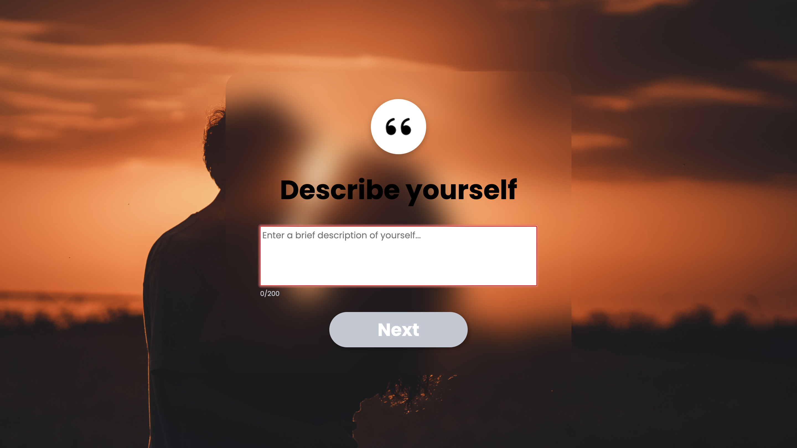
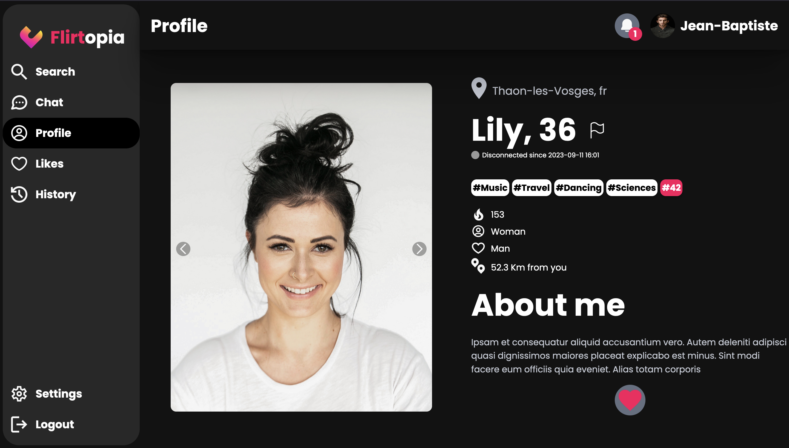
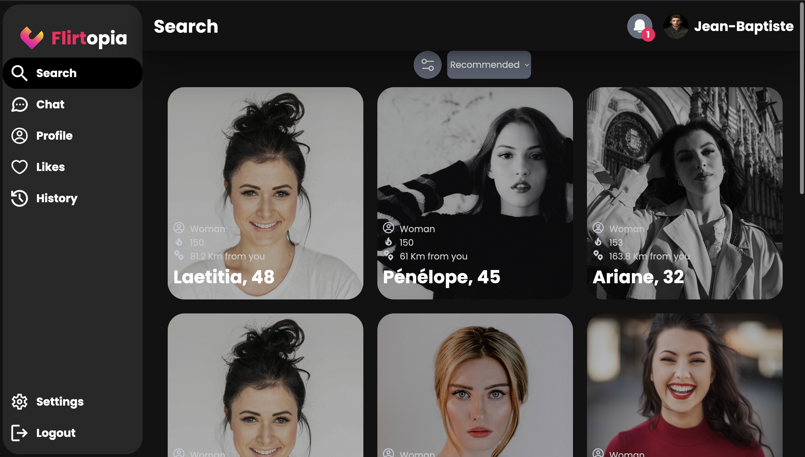
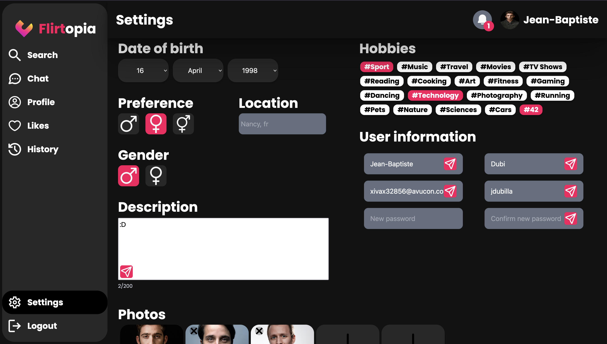
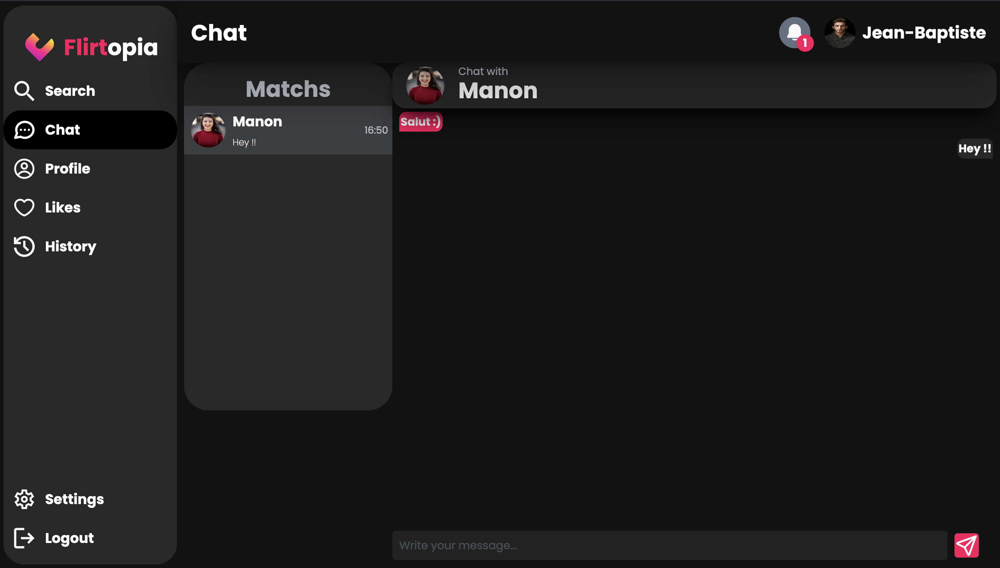

# Matcha

Matcha est un projet de site de rencontres développé dans le cadre du cursus de l'école 42. Il vise à créer une plateforme permettant aux utilisateurs de se connecter en fonction de leurs intérêts, de leur emplacement et de leurs préférences.

## Table des matières

- [Fonctionnalités](#fonctionnalites)
- [Technologies Utilisées](#technologies-utilisees)
- [Installation](#installation)
- [Présentation du projet](#presentation)

  
  
## Fonctionnalités

- Authentification et inscription des utilisateurs
- Création et personnalisation de profil
- Algorithme de mise en relation basé sur les préférences des utilisateurs
- Chat en temps réel entre utilisateurs compatibles
- Géolocalisation et suggestions basées sur la proximité
- Fonctionnalités de signalement et de blocage
- Notifications pour les nouveaux matches et messages

 
  
## Technologies Utilisées

- **Backend**: Node.js, Express.js
- **Base de données**: MySQL
- **Frontend**: React (TypeScript), CSS
- **Communication en temps réel**: Socket.io
- **Géolocalisation**: API Mapbox
- **Sécurité**: JSON Web Tokens (JWT), bcrypt
- **Déploiement**: Docker

 
  
## Installation

Pour exécuter ce projet localement, suivez ces étapes :

1. Cloner le dépôt : `git clone https://github.com/Bubonn/Matcha.git`
2. Naviguer vers le répertoire du projet : `cd Matcha`
3. Configurer les variables d'environnement.
  - Backend : VAR1
  - Frontend: var2
7. Démarrer l'application : `docker compose up --build`
8. Accéder à l'application dans votre navigateur à `http://localhost:3001`

 
  
## Présentation du projet

- Vidéo du projet : https://www.youtube.com/watch?v=5H538Js2X10

### Pages de login

#### Signin

#### Signup

### Pages d'informations de l'utilisateur

## Pages du site

### Profile

### Suggestions

### Settings

### Chat

